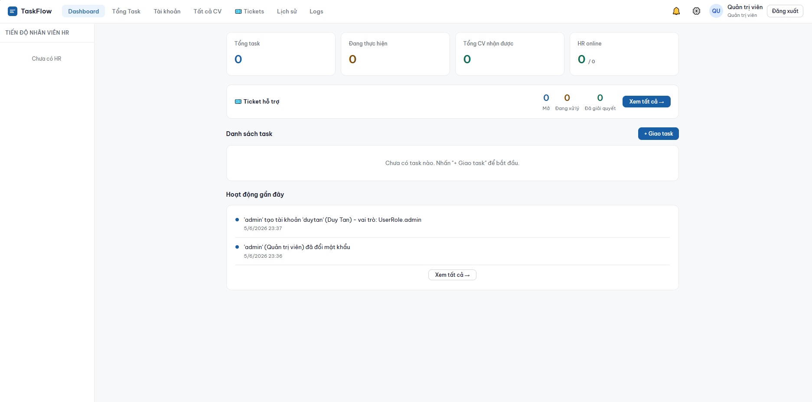
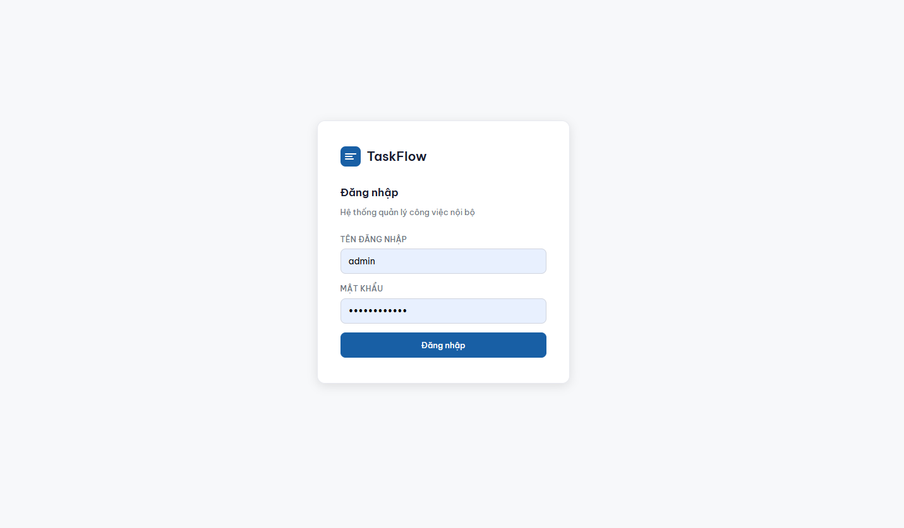
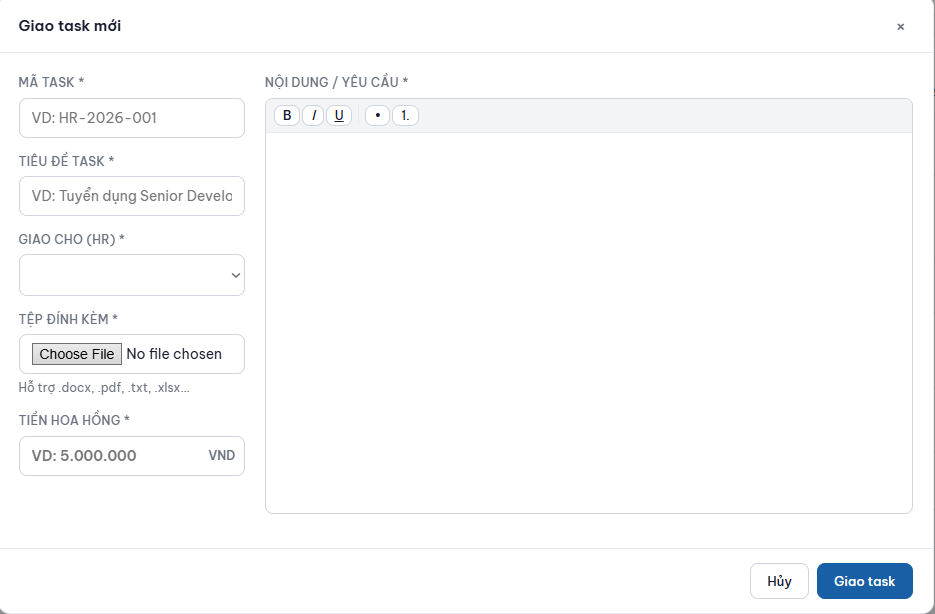
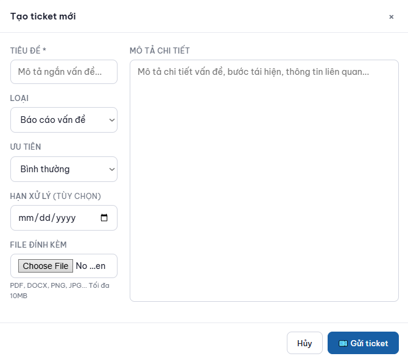

# TaskFlow

Hệ thống quản lý công việc tuyển dụng nội bộ.  
Admin giao task, HR nộp CV, theo dõi hoa hồng & hỗ trợ qua ticket.

<p align="center">
  
</p>

## Tính năng

| | |
|---|---|
| **Phân quyền** | Admin / HR Leader / HR |
| **Giao task** | Rich text editor, file đính kèm, hoa hồng, deadline |
| **Nộp CV** | PDF/DOCX, đánh giá ứng viên |
| **Thanh toán** | Yêu cầu → phê duyệt → xác nhận (kèm ảnh CK) |
| **Ticket** | Hỗ trợ nội bộ với comment thread |
| **Dashboard** | Theo dõi HR realtime, thống kê |
| **Audit log** | Mọi thao tác đều được ghi lại |

## Quick Start

```bash
docker compose -f taskflow/docker-compose.yml up -d
```

Mở `http://localhost:8000` — tài khoản **admin** được tạo tự động khi chạy lần đầu.

## Tech Stack

| Layer | |
|-------|-|
| Backend | Python 3.12+, **FastAPI** |
| Database | **MongoDB** 7.x |
| Frontend | Vanilla JS SPA (zero framework) |
| Auth | JWT + bcrypt |
| Deploy | Docker Compose |

## Screenshots

| Dashboard | Login |
|---|---|---|
|  |  |
| **Drop Task** | **Ticket** |
|  |  |

## Cấu trúc

```
.
├── build.js               # Build & obfuscation (Node.js)
├── screenshots/           # Hình ảnh dự án
└── taskflow/
    ├── main.py            # FastAPI entry point
    ├── core/              # Auth, config, database, rate limiter
    ├── models/            # Pydantic schemas
    ├── routers/           # 8 API modules
    ├── static/            # Frontend SPA (HTML + CSS + 13 JS)
    ├── Dockerfile
    └── docker-compose.yml
```
